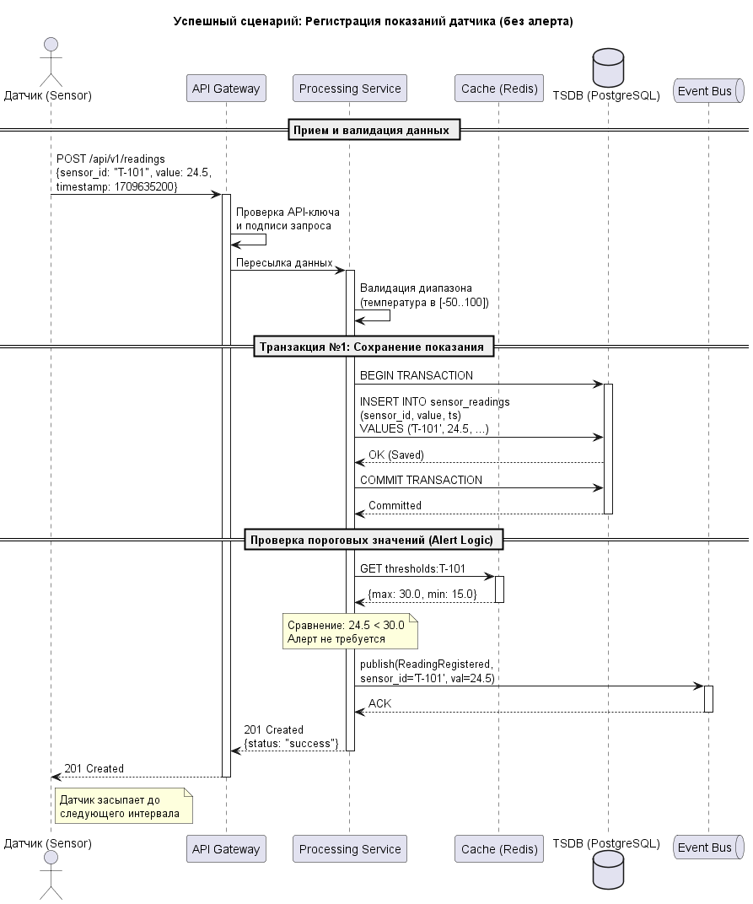
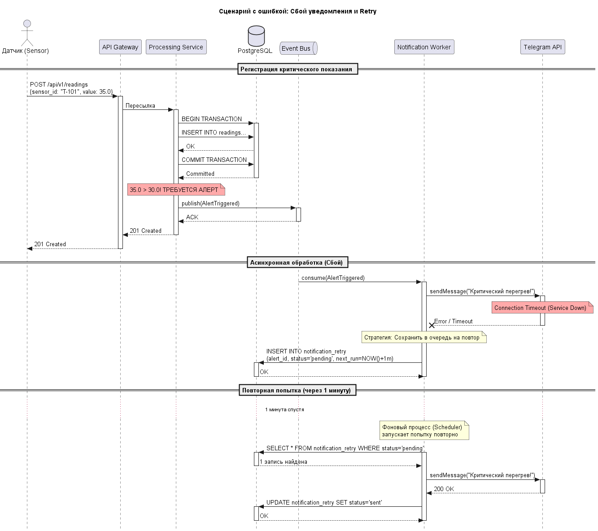

<p align="center">Министерство образования Республики Беларусь</p>
<p align="center">Учреждение образования</p>
<p align="center">"Брестский Государственный технический университет"</p>
<p align="center">Кафедра ИИТ</p>
<br><br><br><br><br><br>
<p align="center"><strong>Лабораторная работа №1</strong></p>
<p align="center"><strong>По дисциплине:</strong> "Проектирование интернет-систем"</p>
<p align="center"><strong>Тема:</strong> "Сценарий транзакции: моделирование use-case и границ ответственности"</p>
<br><br><br><br><br><br>
<p align="right"><strong>Выполнил:</strong></p>
<p align="right">Студент 3 курса</p>
<p align="right">Группы ______</p>
<p align="right">&lt;ваше ФИО&gt;</p>
<p align="right"><strong>Проверил:</strong></p>
<p align="right">Несюк А.Н.</p>
<br><br><br><br><br>
<p align="center"><strong>Брест 2026</strong></p>

---

## Цель работы

Научиться анализировать бизнес-процессы интернет-системы, выявлять границы ответственности компонентов и моделировать транзакционные сценарии с учётом возможных сбоев.

---

## Вариант №38 - Датчики «Умный дом lite»

**Питч:** _Графики красивее, чем провода._

**Ядро домена:** _Датчики, Показания, Графики, Алерты_

---

## Ход выполнения работы

### 1. Структура проекта

```
lab-01/
├── README.md               # Основной отчёт (этот документ)
├── use-case.md             # Текстовое описание use-case
├── diagrams/
│   ├── sequence-happy.puml # PlantUML для успешного сценария
│   ├── sequence-happy.png  # Экспорт диаграммы
│   ├── sequence-error-payment.puml
│   └── sequence-error-payment.png
├── scenarios.feature       # Gherkin-сценарии
└── analysis.md             # Анализ границ ответственности
```

---

### 2. Use-case описание

👉 **Ссылка на файл:** [use-case.md](use-case.md)

**Основной сценарий:** _Регистрация показаний датчика и обработка алертов_

**Первичный актор:** _Датчик_

**Цель:** _Принять данные от датчика, сохранить их для построения графиков и, если значение превышает норму, оперативно уведомить пользователя о критическом событии._

**Краткое описание основного потока:**
1. _Датчик отправляет POST-запрос с текущим показанием (например, температура)._
2. _API Gateway выполняет авторизацию датчика и валидацию формата данных._
3. _Processing Service сохраняет полученное значение в базу данных временных рядов._
4. _Система проверяет значение на соответствие правилам алертов (сравнение с порогом)._
5. _При отсутствии превышений система подтверждает успешный прием данных (201 Created)._
6. _Пользователь получает возможность увидеть новую точку на графике в интерфейсе._

**Альтернативные потоки:** _**Trigger alert:** значение превышает порог, система инициирует отправку уведомления. **Idempotency check:** обнаружен дубликат запроса, система подтверждает успех без повторной записи в БД._

**Исключительные ситуации:** _**Validation error:** некорректный формат данных или неверный API-ключ. **Database unavailable:** сбой при попытке записи показания в базу данных. **Notification service down:** критическое значение получено, но сервис отправки уведомлений недоступен._

---

### 3. Диаграммы последовательности (Sequence Diagrams)

#### 3.1. Happy Path (успешный сценарий)

👉 **PlantUML исходник:** [sequence-happy.puml](diagrams/sequence-happy.puml)



**Описание потока:**
- _Датчик успешно передает штатные показания. Система фиксирует данные в БД (транзакционно) и подтверждает прием. Асинхронно событие публикуется в шину для обновления графиков в реальном времени._

**Участники:**
- _Датчик_
- _API Gateway_
- _Processing Service_
- _Redis_
- _PostgreSQL_
- _Event Bus_

#### 3.2. Error Case (сценарий с ошибкой)

👉 **PlantUML исходник:** [sequence-error-notificathion.puml](diagrams/sequence-error-notification.puml)



**Описание потока:**
- _Датчик фиксирует перегрев. Данные успешно сохраняются, но при попытке отправить мгновенное уведомление через Telegram API происходит сбой. Система использует таблицу notification_retry для гарантированной доставки уведомления после восстановления сервиса._

---

### 4. Gherkin-сценарии

👉 **Ссылка на файл:** [scenarios.feature](scenarios.feature)

**Реализовано сценариев:** _7_

**Список сценариев:**
1. ✅ **Успешный сценарий** (Happy Path)
2. ✅ **Ошибка:** _Некорректный формат данных_
3. ✅ **Ошибка:** _Значение вне физического диапазона_
4. ✅ **Ошибка:** _Сбой уведомлений при критическом показании_
5. ✅ **Ошибка:** _База данных недоступна_
6. ✅ **Ошибка:** _Идемпотентность повторная отправка того же замера_
7. ✅ **Бизнес-кейс:** _Регистрация критического показания_

**Пример сценария:**
```gherkin
Scenario: Успешная регистрация штатных показаний (Норма)
  Given текущее время "10:00:00"
  When датчик "temp-01" отправляет POST-запрос со значением "24.5"
  Then система сохраняет показание в таблицу "sensor_readings"
  And система определяет, что значение находится в пределах нормы
  And датчик получает HTTP ответ со статусом 201 (Created)
  And пользователь видит на графике новую точку "24.5°C"
```

---
### 5. Анализ границ ответственности

👉 **Ссылка на файл:** [analysis.md](analysis.md)

#### 5.1. Транзакционные границы

| Операция                            | Синхронная/Асинхронная | Откат при ошибке | Retry-стратегия                 | Идемпотентность     |
| :---------------------------------- | :--------------------- | :--------------- | :------------------------------ | :------------------ |
| **Валидация JSON и API-ключа**      | Синхронная             | Нет              | N/A                             | Да                  |
| **Запись показания в БД (TSDB)**    | Синхронная             | Да (Rollback)    | 3 попытки со стороны датчика    | Да (sensor_id + ts) |
| **Создание записи об алерте**       | Синхронная             | Да (Rollback)    | N/A                             | Да                  |
| **Отправка уведомления (Push/TG)**  | Асинхронная            | Нет              | Exponential backoff (5 попыток) | Да (alert_id)       |
| **Обновление графиков (WebSocket)** | Асинхронная            | Нет              | Нет (Best effort)               | Нет                 |

#### 5.2. Обработка исключительных ситуаций

**Реализовано стратегий обработки:** 3

**Примеры:**

##### Исключительная ситуация 1: База данных временных рядов (TSDB) недоступна

- **Условие возникновения:** Сервис обработки не может установить соединение с PostgreSQL/InfluxDB.
- **Обнаружение:** Перехват `DatabaseConnectionException` при попытке открытия транзакции.
- **Реакция:** Система прерывает обработку и возвращает датчику HTTP 503 (Service Unavailable).
- **Компенсация:** Откат текущей транзакции (если была начата). Данные не подтверждаются.
- **Уведомление пользователя:** Запись в системный лог (датчик повторит попытку позже, пользователь увидит пропуск на графике только если датчик не сможет передать данные долгое время).

##### Исключительная ситуация 2: Сбой сервиса уведомлений (Notification Service)

- **Условие возникновения:** Порог превышен (алерт), но внешний API (Telegram/Firebase) вернул ошибку или таймаут.
- **Обнаружение:** Получение ошибки от HTTP-клиента или `TimeoutException`.
- **Реакция:** Система НЕ откатывает запись данных, алерт сохраняется в БД со статусом `PENDING_RETRY`.
- **Компенсация:** Отсутствует (данные первичны, их удалять нельзя).
- **Уведомление пользователя:** Пользователь получит уведомление позже, как только сервис восстановится (с пометкой о задержке).

##### Исключительная ситуация 3: Дублирование пакета данных (Сетевой лаг)

- **Условие возникновения:** Датчик отправил данные дважды из-за отсутствия вовремя полученного подтверждения.
- **Обнаружение:** Срабатывание `Unique Constraint` (sensor_id + timestamp) в базе данных.
- **Реакция:** Система игнорирует вставку (ON CONFLICT DO NOTHING).
- **Компенсация:** Нет.
- **Уведомление пользователя:** Датчику возвращается `200 OK` для подтверждения, чтобы он очистил свой буфер. Пользователь дубликатов на графике не видит.

---

## Таблица критериев оценки

| Критерий                                                                                                          | Баллы   | Выполнено |
| ----------------------------------------------------------------------------------------------------------------- | ------- | --------- |
| Use-case описание (полнота: акторы, предусловия, основной поток, альтернативы, исключения)                        | 15      | ❌ / ✅     |
| Sequence diagram (happy path) - корректность нотации UML, включение всех ключевых компонентов                     | 20      | ❌ / ✅     |
| Sequence diagram (error case) - моделирование хотя бы одной исключительной ситуации                               | 15      | ❌ / ✅     |
| Gherkin-сценарии - минимум 4 сценария (1 успешный + 3 ошибочных)                                                  | 20      | ❌ / ✅     |
| Анализ границ ответственности - таблица транзакционных границ, обоснование выбора синхронных/асинхронных операций | 15      | ❌ / ✅     |
| Обработка исключений - описание стратегий retry, компенсации, уведомлений                                         | 10      | ❌ / ✅     |
| Качество документации - оформление, читаемость, грамотность                                                       | 5       | ❌ / ✅     |
| **ИТОГО**                                                                                                         | **100** |           |

---

## Контрольные вопросы

**Подготовка к защите:**

1. Что такое транзакционная граница? Где она проходит в вашем сценарии?
   - _Это предел, внутри которого операции выполняются атомарно (все или ничего). В моем сценарии первая граница — это запись данных в БД, вторая — создание алерта_

2. Почему операция X выбрана синхронной, а Y - асинхронной?
   - _Запись в БД синхронна, так как нам нужно гарантировать сохранность данных перед ответом датчику. Уведомления асинхронны, чтобы медленные внешние API не блокировали поток приема данных._

3. Как обеспечить идемпотентность при повторных запросах?
   - _Использованием уникальных составных ключей в БД и проверкой уникальных ID запросов/событий_

4. Что произойдёт, если внешний сервис вернёт ошибку после частичного выполнения операции?
   - _ Мы используем таблицу-черновик или очередь, чтобы доотправить данные позже без отката основных бизнес-данных_

5. Как система обнаружит, что внешний сервис недоступен?
   - _Через срабатывание таймаутов, получение HTTP-ошибок или перехват исключений сетевого соединения._

6. Какие данные нужно логировать для диагностики сбоев?
   - _ID запроса, ID датчика, тело входящего сообщения, код ошибки внешнего сервиса и временную метку сбоя._

---

## Ссылка на репозиторий

👉 **GitHub:** _https://github.com/DakariLuin/PIS-2026/_

---

## Вывод

> В ходе выполнения лабораторной работы был проанализирован бизнес-процесс системы «Умный дом lite» (регистрация показаний датчиков и обработка алертов). Разработаны use-case описания для основного сценария и альтернативных потоков. Построены sequence diagrams с использованием PlantUML для визуализации взаимодействия компонентов системы. Созданы Gherkin-сценарии для автоматизированного тестирования. Определены транзакционные границы и стратегии обработки ошибок. Освоены навыки моделирования транзакционных сценариев и анализа точек отказа в интернет-системах.

---

**Дата выполнения:** _05.03.2026_

**Оценка:** _____________

**Подпись преподавателя:** _____________
