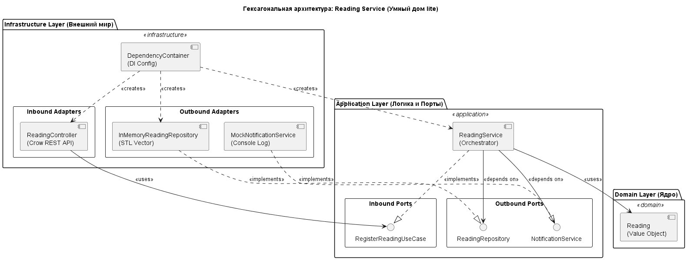

# Архитектура сервиса Reading Service (Вариант 38)

## 1. Общий обзор
Сервис Reading Service спроектирован с использованием **Гексагональной архитектуры** (известной также как "Порты и Адаптеры"). Основная цель — полная изоляция бизнес-логики умного дома от деталей реализации (фреймворка Crow, сетевых протоколов и способов хранения данных).

## 2. Архитектурная диаграмма

## 3. Описание слоев и компонентов

### 3.1. Domain Layer (`src/domain/`)
Содержит "чистое" ядро системы. 
*   **Reading**: Модель данных показания. Не зависит ни от каких библиотек, кроме стандартной библиотеки C++.
*   **Изоляция**: Слой не знает о существовании базы данных, сети или способах уведомления.

### 3.2. Application Layer (`src/application/`)
Содержит бизнес-логику и интерфейсы для взаимодействия с внешним миром.
*   **Inbound Ports (`port/in/`)**: Интерфейс `RegisterReadingUseCase`. Описывает, что система может сделать для внешнего клиента.
*   **Outbound Ports (`port/out/`)**: Интерфейсы `ReadingRepository` и `NotificationService`. Описывают потребности системы (сохранение, уведомление).
*   **Service (`service/`)**: Класс `ReadingService`. Реализует логику: "Принять данные -> Сохранить -> Если температура > 30, вызвать порт уведомления".

### 3.3. Infrastructure Layer (`src/infrastructure/`)
Содержит реализацию портов и технические детали.
*   **Inbound Adapters (`adapter/in/`)**: `ReadingController` на базе Crow. Преобразует HTTP/JSON запросы в вызовы портов приложения.
*   **Outbound Adapters (`adapter/out/`)**: `InMemoryReadingRepository` (хранение в `std::vector`) и `MockNotificationService` (имитация Telegram).
*   **Config (`config/`)**: `DependencyContainer`. Связывает все части воедино через Dependency Injection.

## 4. Обоснование структуры

### Использование Namespaces
В проекте активно используются вложенные пространства имен (например, `infrastructure::adapter::out`). Это сделано для:
1.  **Архитектурной навигации**: По названию типа сразу понятно, к какому слою и типу компонента он относится.
2.  **Изоляции**: Позволяет иметь компоненты с одинаковыми именами в разных слоях (например, интерфейс и его реализация) без конфликтов имен.

### Группировка файлов
Заголовочные файлы (`.hpp`) и файлы реализации (`.cpp`) сгруппированы в подпапках по функциональному назначению, а не по расширению. Это типичный подход для **модульной архитектуры**, упрощающий поддержку конкретного модуля (например, слоя портов), так как все относящиеся к нему файлы находятся в одном месте.

## 5. Применение принципов SOLID

*   **DIP (Dependency Inversion Principle)**: Слой Application не зависит от Infrastructure. Вместо этого Infrastructure зависит от интерфейсов, объявленных в Application.
*   **OCP (Open/Closed Principle)**: Мы можем добавить адаптер для работы с реальной БД PostgreSQL, не меняя ни строчки кода в доменном или прикладном слоях.