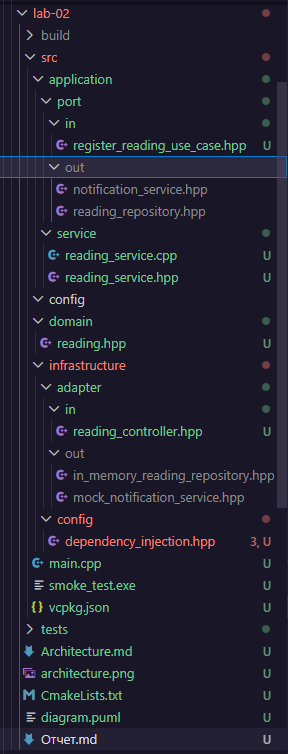
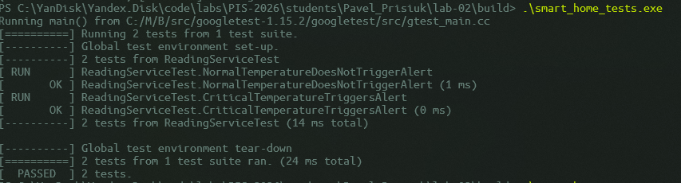

<p align="center">Министерство образования Республики Беларусь</p>
<p align="center">Учреждение образования</p>
<p align="center">"Брестский Государственный технический университет"</p>
<p align="center">Кафедра ИИТ</p>
<br><br><br><br><br><br>
<p align="center"><strong>Лабораторная работа №2</strong></p>
<p align="center"><strong>По дисциплине:</strong> "Проектирование интернет-систем"</p>
<p align="center"><strong>Тема:</strong> "Гексагональная архитектура: проектирование портов и адаптеров"</p>
<br><br><br><br><br><br>
<p align="right"><strong>Выполнил:</strong></p>
<p align="right">Студент 3 курса</p>
<p align="right">ПО-12</p>
<p align="right">Присюк П.Д.</p>
<p align="right"><strong>Проверил:</strong></p>
<p align="right">Несюк А.Н.</p>
<br><br><br><br><br>
<p align="center"><strong>Брест 2026</strong></p>

---

## Цель работы

Спроектировать архитектуру основного сервиса системы с использованием гексагональной (hexagonal) архитектуры: создать структуру проекта, определить порты (интерфейсы) и продемонстрировать изоляцию слоёв через минимальные примеры.

---

## Вариант №38 - Датчики «Умный дом lite»

**Питч:** Графики красивее, чем провода. 
**Ядро домена:** Датчики, Показания, Графики, Алерты.

**Выбранный сервис:** Reading Service

---

## Ход выполнения работы

### Часть 1. Архитектурная диаграмма

**Описание сервиса:** Понял тебя, исправляюсь! Давай заполним отчет строго по предоставленному тобой шаблону, используя наш реальный стек (C++, Crow, CMake) и логику «Умного дома».

Вот готовый текст отчета. Тебе нужно только вставить скриншоты в соответствующие разделы.
<p align="center">Министерство образования Республики Беларусь</p>
<p align="center">Учреждение образования</p>
<p align="center">"Брестский Государственный технический университет"</p>
<p align="center">Кафедра ИИТ</p>
<br><br><br><br><br><br>
<p align="center"><strong>Лабораторная работа №2</strong></p>
<p align="center"><strong>По дисциплине:</strong> "Проектирование интернет-систем"</p>
<p align="center"><strong>Тема:</strong> "Гексагональная архитектура: проектирование портов и адаптеров"</p>
<br><br><br><br><br><br>
<p align="right"><strong>Выполнил:</strong></p>
<p align="right">Студент 3 курса</p>
<p align="right">Группы ИИ-24</p>
<p align="right">Присюк П. С.</p>
<p align="right"><strong>Проверил:</strong></p>
<p align="right">Несюк А.Н.</p>
<br><br><br><br><br>
<p align="center"><strong>Брест 2026</strong></p>
Цель работы

Спроектировать архитектуру основного сервиса системы с использованием гексагональной (hexagonal) архитектуры: создать структуру проекта, определить порты (интерфейсы) и продемонстрировать изоляцию слоёв через минимальные примеры.
Вариант №38 - Датчики «Умный дом lite»

Питч: Графики красивее, чем провода.
Ядро домена: Датчики, Показания, Графики, Алерты.

Выбранный сервис: Reading Service (Прием и первичная обработка показаний датчиков).
Ход выполнения работы
Часть 1. Архитектурная диаграмма

Описание сервиса:
Reading Service отвечает за прием данных телеметрии от датчиков, их валидацию, транзакционное сохранение и проверку на критические отклонения (перегрев). Если значение превышает порог, сервис инициирует отправку уведомления.

**Диаграмма слоёв:**
Диаграмма в формате PlantUML и графическом виде представлена в приложении Architecture.md. Основной принцип: Domain в центре, Application окружает его портами, Infrastructure содержит реализации адаптеров.

---

### Часть 2. Структура проекта (скелет)

**Технология:** C++ (Стандарт 17), CMake, vcpkg.

**Структура папок:**

```
lab-02/
├── CMakeLists.txt
├── vcpkg.json
├── src/
│   ├── domain/
│   │   └── reading.hpp          # Value Object: Reading
│   ├── application/
│   │   ├── port/
│   │   │   ├── in/
│   │   │   │   └── register_reading_use_case.hpp
│   │   │   └── out/
│   │   │       ├── reading_repository.hpp
│   │   │       └── notification_service.hpp
│   │   └── service/
│   │       ├── reading_service.hpp
│   │       └── reading_service.cpp   # Реализация логики
│   └── infrastructure/
│       ├── adapter/
│       │   ├── in/
│       │   │   └── reading_controller.hpp # Crow REST Controller
│       │   └── out/
│       │       ├── in_memory_reading_repository.hpp
│       │       └── mock_notification_service.hpp
│       └── config/
│           └── dependency_injection.hpp
└── tests/
    └── reading_service_test.cpp
```

**Скриншот структуры в IDE**:****



---

### Часть 3. Domain Layer (Доменный слой)

#### Доменные сущности

**Value Object 1:**: Reading

```cpp
// domain/reading.hpp
namespace domain {
    struct Reading {
        std::string sensor_id;
        double value;
        Reading(std::string id, double val) : sensor_id(std::move(id)), value(val) {}
    };
}
```
#### Бизнес-правила

Перечислите основные бизнес-правила, реализованные в domain слое:

1. Каждое показание должно быть сохранено в историю (Persistence).
2. Если значение температуры превышает 30.0 градусов, система должна создать уведомление о перегреве.

---

### Часть 4. Application Layer (Прикладной слой)

#### Входящие порты (Inbound Ports)

Интерфейсы, которые предоставляет система внешнему миру:

**RegisterReadingUseCase**:
```cpp
class RegisterReadingUseCase {
public:
    virtual ~RegisterReadingUseCase() = default;
    virtual std::string register_reading(const RegisterReadingCommand& command) = 0;
};
```

#### Исходящие порты (Outbound Ports)

Интерфейсы, через которые система взаимодействует с внешним миром:

**ReadingRepository**:
```cpp
class ReadingRepository {
public:
    virtual ~ReadingRepository() = default;
    virtual void save(const domain::Reading& reading) = 0;
};
```

**NotificationService**:
```cpp
class NotificationService {
public:
    virtual ~NotificationService() = default;
    virtual void send_alert(const std::string& sensor_id, const std::string& message) = 0;
};
```

#### Application Service

**ReadingService** (реализует входящие порты):

```cpp
std::string ReadingService::register_reading(const port::in::RegisterReadingCommand& command) {
    domain::Reading reading(command.sensor_id, command.value);
    repository->save(reading);
    if (command.value > 30.0) {
        notifications->send_alert(command.sensor_id, "Внимание! Перегрев");
    }
    return "SUCCESS";
}
```

**Основная логика**:
Метод register_reading выступает в роли оркестратора. Он принимает команду (DTO), конвертирует её во внутреннее представление доменного слоя (Reading) и координирует работу двух исходящих портов. Сначала данные передаются в репозиторий для персистентного хранения. Затем выполняется проверка ключевого бизнес-правила системы: если зафиксированная температура превышает критический порог, сервис инициирует отправку алерта через абстрактный интерфейс уведомлений, не заботясь о том, каким именно способом (Telegram, SMS или Push) он будет доставлен.

---

### Часть 5. Infrastructure Layer (Инфраструктурный слой)

#### Входящий адаптер: REST API

**ReadingController**:

```cpp
CROW_ROUTE(app, "/api/readings").methods(crow::HTTPMethod::POST)
([this](const crow::request& req) {
    auto json_body = crow::json::load(req.body);
    application::port::in::RegisterReadingCommand cmd{json_body["sensor_id"].s(), json_body["value"].d()};
    return crow::response(201, use_case->register_reading(cmd));
});
```

**Эндпоинты**:
- `POST /api/readings` - регистрация нового показания датчика.
- `GET /api/health` - проверка работоспособности сервиса.

**Пример запроса/ответа**:

```json
POST /api/readings
{
  "sensor_id": "T-101",
  "value": 35.5
}

Ответ:
{
  "status": "success",
  "message": "SUCCESS"
}
```

#### Исходящий адаптер: Repository

**InMemoryReadingRepository:

```cpp
void save(const domain::Reading& reading) override {
    db.push_back(reading); // Сохранение в std::vector
    std::cout << "[DB Adapter] Сохранено в память: Sensor=" 
              << reading.sensor_id << ", Value=" << reading.value << "\n";
}
```

**Принцип работы**:
Данные хранятся в оперативной памяти в контейнере std::vector. Это позволяет быстро протестировать бизнес-логику без развертывания полноценной СУБД. При перезапуске сервера данные обнуляются.

#### Исходящий адаптер: Payment Gateway

**Notification Service**:

```cpp
void send_alert(const std::string& sensor_id, const std::string& message) override {
    // Имитация отправки через внешний API
    std::cout << "[Telegram Adapter] Отправка алерта владельцу датчика " 
              << sensor_id << ": '" << message << "'\n";
}
```

**Логика**:
Адаптер имитирует интеграцию с мессенджером Telegram или Push-сервисом. Вместо реального сетевого запроса к внешнему API, он выводит форматированное сообщение в консоль сервера, что позволяет верифицировать срабатывание бизнес-правил при тестировании.

---

### Часть 6. Dependency Injection (Конфигурация зависимостей)

**DependencyContainer:**:

```cpp
// infrastructure/config/dependency_injection.hpp

DependencyContainer() {
    // 1. Создаем конкретные реализации адаптеров
    auto repo = std::make_shared<adapter::out::InMemoryReadingRepository>();
    auto notif = std::make_shared<adapter::out::MockNotificationService>();

    // 2. Внедряем их в конструктор сервиса (Inversion of Control)
    reading_service = std::make_shared<application::service::ReadingService>(repo, notif);
}
```

**Как работает DI**:
В классе DependencyContainer происходит связывание интерфейсов портов с их конкретными инфраструктурными реализациями. Созданные объекты адаптеров передаются в ReadingService через конструктор в виде умных указателей std::shared_ptr. Это позволяет приложению работать с абстракциями, не зависячи от деталей реализации адаптеров.

---

### Часть 7. Тестирование

#### Юнит-тесты для OrderService

```cpp
TEST_F(ReadingServiceTest, CriticalTemperatureTriggersAlert) {
    EXPECT_CALL(*mock_repo, save(_)).Times(1);
    EXPECT_CALL(*mock_notif, send_alert(_, _)).Times(1);
    service->register_reading({"T-101", 35.0});
}
```

**Что тестируется**:
- ✅ Изолированная работа бизнес-логики.
- ✅ Корректность вызова порта уведомлений при перегреве.

**Mock-объекты**:
_[Опишите, как вы мокируете OrderRepository и PaymentGateway]_

**Результаты тестов**:



---

## 3. Архитектурная диаграмма

### Диаграмма слоёв

Понял тебя, исправляюсь! Давай заполним отчет строго по предоставленному тобой шаблону, используя наш реальный стек (C++, Crow, CMake) и логику «Умного дома».

Вот готовый текст отчета. Тебе нужно только вставить скриншоты в соответствующие разделы.
<p align="center">Министерство образования Республики Беларусь</p>
<p align="center">Учреждение образования</p>
<p align="center">"Брестский Государственный технический университет"</p>
<p align="center">Кафедра ИИТ</p>
<br><br><br><br><br><br>
<p align="center"><strong>Лабораторная работа №2</strong></p>
<p align="center"><strong>По дисциплине:</strong> "Проектирование интернет-систем"</p>
<p align="center"><strong>Тема:</strong> "Гексагональная архитектура: проектирование портов и адаптеров"</p>
<br><br><br><br><br><br>
<p align="right"><strong>Выполнил:</strong></p>
<p align="right">Студент 3 курса</p>
<p align="right">Группы ИИ-24</p>
<p align="right">Присюк П. С.</p>
<p align="right"><strong>Проверил:</strong></p>
<p align="right">Несюк А.Н.</p>
<br><br><br><br><br>
<p align="center"><strong>Брест 2026</strong></p>
Цель работы

Спроектировать архитектуру основного сервиса системы с использованием гексагональной (hexagonal) архитектуры: создать структуру проекта, определить порты (интерфейсы) и продемонстрировать изоляцию слоёв через минимальные примеры.
Вариант №38 - Датчики «Умный дом lite»

Питч: Графики красивее, чем провода.
Ядро домена: Датчики, Показания, Графики, Алерты.

Выбранный сервис: Reading Service (Прием и первичная обработка показаний датчиков).
Ход выполнения работы
Часть 1. Архитектурная диаграмма

Описание сервиса:
Reading Service отвечает за прием данных телеметрии от датчиков, их валидацию, транзакционное сохранение и проверку на критические отклонения (перегрев). Если значение превышает порог, сервис инициирует отправку уведомления.

Диаграмма слоёв:
Диаграмма в формате PlantUML и графическом виде представлена в приложении Architecture.md. Основной принцип: Domain в центре, Application окружает его портами, Infrastructure содержит реализации адаптеров.
Часть 2. Структура проекта (скелет)

Технология: C++ (Стандарт 17), CMake, vcpkg.

Структура папок:
code Text

lab-02/
├── CMakeLists.txt
├── vcpkg.json
├── src/
│   ├── domain/
│   │   └── reading.hpp          # Value Object: Reading
│   ├── application/
│   │   ├── port/
│   │   │   ├── in/
│   │   │   │   └── register_reading_use_case.hpp
│   │   │   └── out/
│   │   │       ├── reading_repository.hpp
│   │   │       └── notification_service.hpp
│   │   └── service/
│   │       ├── reading_service.hpp
│   │       └── reading_service.cpp   # Реализация логики
│   └── infrastructure/
│       ├── adapter/
│       │   ├── in/
│       │   │   └── reading_controller.hpp # Crow REST Controller
│       │   └── out/
│       │       ├── in_memory_reading_repository.hpp
│       │       └── mock_notification_service.hpp
│       └── config/
│           └── dependency_injection.hpp
└── tests/
    └── reading_service_test.cpp

Скриншот структуры в IDE:
[Вставьте скриншот дерева файлов из VS Code]
Часть 3. Domain Layer (Доменный слой)
Доменные сущности

Value Object 1: Reading
code C++

// domain/reading.hpp
namespace domain {
    struct Reading {
        std::string sensor_id;
        double value;
        Reading(std::string id, double val) : sensor_id(std::move(id)), value(val) {}
    };
}

Бизнес-правила

    Каждое показание должно быть сохранено в историю (Persistence).

    Если значение температуры превышает 30.0 градусов, система должна создать уведомление о перегреве.

Часть 4. Application Layer (Прикладной слой)
Входящие порты (Inbound Ports)

RegisterReadingUseCase:
code C++

class RegisterReadingUseCase {
public:
    virtual ~RegisterReadingUseCase() = default;
    virtual std::string register_reading(const RegisterReadingCommand& command) = 0;
};

Исходящие порты (Outbound Ports)

ReadingRepository:
code C++

class ReadingRepository {
public:
    virtual ~ReadingRepository() = default;
    virtual void save(const domain::Reading& reading) = 0;
};

NotificationService:
code C++

class NotificationService {
public:
    virtual ~NotificationService() = default;
    virtual void send_alert(const std::string& sensor_id, const std::string& message) = 0;
};

Application Service

ReadingService:
code C++

std::string ReadingService::register_reading(const port::in::RegisterReadingCommand& command) {
    domain::Reading reading(command.sensor_id, command.value);
    repository->save(reading);
    if (command.value > 30.0) {
        notifications->send_alert(command.sensor_id, "Внимание! Перегрев");
    }
    return "SUCCESS";
}

Часть 5. Infrastructure Layer (Инфраструктурный слой)
Входящий адаптер: REST API (Crow)
code C++

CROW_ROUTE(app, "/api/readings").methods(crow::HTTPMethod::POST)
([this](const crow::request& req) {
    auto json_body = crow::json::load(req.body);
    application::port::in::RegisterReadingCommand cmd{json_body["sensor_id"].s(), json_body["value"].d()};
    return crow::response(201, use_case->register_reading(cmd));
});

Исходящий адаптер: Repository

InMemoryReadingRepository: хранит данные в std::vector<domain::Reading>, имитируя работу БД в оперативной памяти.
Исходящий адаптер: Notification Service

MockNotificationService: выводит алерты в стандартный поток вывода (консоль), имитируя отправку Telegram-уведомления.
Часть 6. Dependency Injection (Конфигурация зависимостей)

DependencyContainer:
Использует std::shared_ptr для управления временем жизни объектов.
code C++

DependencyContainer() {
    auto repo = std::make_shared<adapter::out::InMemoryReadingRepository>();
    auto notif = std::make_shared<adapter::out::MockNotificationService>();
    reading_service = std::make_shared<application::service::ReadingService>(repo, notif);
}

Часть 7. Тестирование
Юнит-тесты для ReadingService
code C++

TEST_F(ReadingServiceTest, CriticalTemperatureTriggersAlert) {
    EXPECT_CALL(*mock_repo, save(_)).Times(1);
    EXPECT_CALL(*mock_notif, send_alert(_, _)).Times(1);
    service->register_reading({"T-101", 35.0});
}

Что тестируется:
    1. ✅ Изолированная работа бизнес-логики.
    2. ✅ Корректность вызова порта уведомлений при перегреве.

Результаты тестов:
Для тестирования прикладного слоя в изоляции от внешней инфраструктуры были созданы Mock-классы с использованием библиотеки Google Mock.
    1. MockReadingRepository: Наследуется от интерфейса исходящего порта ReadingRepository. С помощью макроса MOCK_METHOD подменяется метод save. Это позволяет в тестах проверять, была ли попытка сохранить данные в базу, без использования реального хранилища.
    2. MockNotificationService: Наследуется от порта NotificationService. Позволяет верифицировать отправку уведомлений. Мы используем EXPECT_CALL, чтобы убедиться, что при перегреве сервис действительно пытается отправить сообщение, и, наоборот, не вызывает отправку при нормальной температуре.

Использование моков позволяет сделать тесты детерминированными и быстрыми, так как они не зависят от состояния памяти или сетевых задержек.
3. Архитектурная диаграмма
Диаграмма слоёв

Полная графическая диаграмма представлена в файле Architecture.md. Схема зависимостей:
Infrastructure -> Application -> Domain.

### Описание портов и адаптеров

Описание портов и адаптеров
Тип	Название	Назначение
Входящий порт	RegisterReadingUseCase	Интерфейс для регистрации данных
Исходящий порт	ReadingRepository	Интерфейс для сохранения данных
Исходящий порт	NotificationService	Интерфейс для уведомлений
Входящий адаптер	ReadingController (Crow)	REST API для датчиков
Исходящий адаптер	InMemoryReadingRepository	Хранение данных в векторе
Исходящий адаптер	MockNotificationService	Вывод алертов в консоль

---

  ## 4. Критерии выполнения

  | Критерий                                              | Выполнено | Комментарий         |
  | ----------------------------------------------------- | --------- | ------------------- |
  | Структура проекта (domain/application/infrastructure) | ✅         | _[Ваш комментарий]_ |
  | Domain Layer (чистая бизнес-логика)                   | ✅         | _[...]_             |
  | Порты (входящие и исходящие интерфейсы)               | ✅         | _[...]_             |
  | Адаптеры (минимум 1 входящий + 2 исходящих)           | ✅         | _[...]_             |
  | DI-конфигурация (зависимости инжектятся)              | ✅         | _[...]_             |
  | Юнит-тесты для OrderService с моками                  | ✅         | _[...]_             |
  | Документация (диаграмма, описание)                    | ✅         | _[...]_             |

  **Итого**: 7 / 7

  ---

  ## 5. Бонусные задания (если выполнены)

  | Бонус                                      | Выполнено | Комментарий |
  | ------------------------------------------ | --------- | ----------- |
  | EventBus для уведомлений                   | ❌         | _[...]_     |
  | Замена на реальную БД (PostgreSQL/MongoDB) | ❌         | _[...]_     |
  | GraphQL адаптер                            | ❌         | _[...]_     |
  | Интеграционные тесты (TestContainers)      | ❌         | _[...]_     |
  | CQRS разделение                            | ❌         | _[...]_     |

---

## 6. Выводы

### Что получилось хорошо

Удалось создать полностью работоспособный REST-сервис на C++, используя современные библиотеки (Crow, GTest). Гексагональная архитектура позволила легко протестировать сервис с помощью моков, не запуская сервер.

### С какими трудностями столкнулись

Настройка CMake и vcpkg под Windows потребовала правильного подключения системных библиотек сокетов (ws2_32). Также возникли нюансы с пространствами имен в C++ при использовании вложенных структур.

### Что узнали нового

Принципы DIP и IoC в контексте C++. Понял преимущество интерфейсов (портов) для обеспечения гибкости системы при замене инфраструктурных решений.

### Как можно улучшить

Добавить реальную базу данных, использовать API Telegram для алёртов

---

---

**Дата сдачи**: 13.04.2026  
**Подпись студента**: Присюк П.Д
