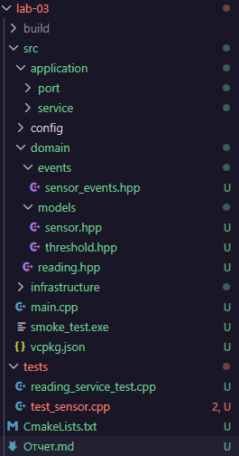

<p align="center">Министерство образования Республики Беларусь</p>
<p align="center">Учреждение образования</p>
<p align="center">"Брестский Государственный технический университет"</p>
<p align="center">Кафедра ИИТ</p>
<br><br><br><br><br><br>
<p align="center"><strong>Лабораторная работа №3</strong></p>
<p align="center"><strong>По дисциплине:</strong> "Проектирование интернет-систем"</p>
<p align="center"><strong>Тема:</strong> "Реализация Domain Layer с DDD-паттернами"</p>
<br><br><br><br><br><br>
<p align="right"><strong>Выполнил:</strong></p>
<p align="right">Студент 3 курса</p>
<p align="right">Группа ПО-12</p>
<p align="right">Присюк П.Д.</p>
<p align="right"><strong>Проверил:</strong></p>
<p align="right">Несюк А.Н.</p>
<br><br><br><br><br>
<p align="center"><strong>Брест 2026</strong></p>

---

## Цель работы

Научиться применять тактические паттерны DDD (Entities, Value Objects, Aggregates, Domain Events) для реализации **доменного слоя** с инвариантами и доменной логикой.

---

Вариант №38 - Датчики «Умный дом lite»

Питч: Графики красивее, чем провода.
Ядро домена: Датчики, Показания, Графики, Алерты.

---

## Ход выполнения работы

### 1. Value Objects (Ценностные Объекты)

**Созданные Value Objects:**

1. **Threshold** - Описание границ безопасной работы датчика (Min/Max).
   - Валидация: Значение min должно быть строго меньше max.
   - Иммутабельность: ✅
   - Файл: `domain/models/threshold.hpp`

2. **ReadingValue** - Обертка над числовым значением показания.
   - Валидация: Проверка на физическую достижимость значения (например, для температуры от -100 до +200).
   - Иммутабельность: ✅
   - Файл: `domain/models/reading_value.hpp`

**Пример кода**:
```cpp
class Threshold {
private:
    double min_val;
    double max_val;
public:
    Threshold(double min, double max) : min_val(min), max_val(max) {
        if (min >= max) {
            throw std::invalid_argument("Threshold Min must be less than Max");
        }
    }
    bool is_violated(double value) const {
        return value < min_val || value > max_val;
    }
};
```

**Терминал:**

[ RUN      ] ThresholdTest.InvalidRangeThrowsException
[       OK ] ThresholdTest.InvalidRangeThrowsException (12 ms)
[----------] 1 test from ThresholdTest (17 ms total)

---

### 2. Entities (Сущности)

**Созданные Entity:**

1. **Sensor** - Датчик
   - ID поле: `id`
   - Бизнес-правила: Не принимает данные в деактивированном состоянии, управляет пороговыми значениями.
   - Файл: `domain/models/sensor.hpp`

2. **Alert** - Запись об инциденте превышения порога.
   - ID поле: `alert_id`
   - Бизнес-правила: Содержит ссылку на датчик и значение, вызвавшее сработку.
   - Файл: `domain/models/alert.hpp`

**Пример кода** (одна Entity):
```cpp
void process_reading(double value) {
    if (!is_active) {
        throw std::runtime_error("Cannot process reading: Sensor is inactive");
    }
    // Проверка физического инварианта
    if (value < -100.0 || value > 200.0) {
        throw std::invalid_argument("Physical limit exceeded");
    }
}
```

**Терминал:**
[----------] 3 tests from SensorTest
[ RUN      ] SensorTest.PhysicalLimitInvariant
[       OK ] SensorTest.PhysicalLimitInvariant (0 ms)
[ RUN      ] SensorTest.AlertEventIsRegistered
[       OK ] SensorTest.AlertEventIsRegistered (0 ms)
[ RUN      ] SensorTest.InactiveSensorInvariant
[       OK ] SensorTest.InactiveSensorInvariant (0 ms)
[----------] 3 tests from SensorTest (12 ms total)

---

### 3. Aggregate Root (Корневой агрегат)

**Aggregate Root:** Sensor

**Границы агрегата:**
- Корень: `Sensor`
- Внутренние сущности: `Alert`
- Value Objects: `Threshold, ReadingValue`

**Инварианты агрегата:**

| №   | Инвариант                                          | Как проверяется                                          |
| --- | -------------------------------------------------- | -------------------------------------------------------- |
| 1   | Нельзя обрабатывать данные, если датчик отключен   | Проверка флага is_active в методе process_reading()      |
| 2   | Границы безопасности датчика не могут пересекаться | Проверка min < max в конструкторе Value Object Threshold |
| 3   | Показание должно быть физически корректным         | Валидация value в методе process_reading()               |

**Пример кода Aggregate Root:**
```cpp
class Sensor {
    // ... поля ...
    void process_reading(double value) {
        // Проверка инвариантов состояния и данных
        ensure_active();
        validate_physical_bounds(value);

        if (safety_threshold.is_violated(value)) {
            // Регистрация доменного события при нарушении инварианта безопасности
            register_event(std::make_shared<AlertTriggered>(id, value));
        }
    }
};
```

**Скриншот тестов инвариантов:**

[----------] 3 tests from SensorTest
[ RUN      ] SensorTest.PhysicalLimitInvariant
[       OK ] SensorTest.PhysicalLimitInvariant (0 ms)
[ RUN      ] SensorTest.AlertEventIsRegistered
[       OK ] SensorTest.AlertEventIsRegistered (0 ms)
[ RUN      ] SensorTest.InactiveSensorInvariant
[       OK ] SensorTest.InactiveSensorInvariant (0 ms)
[----------] 3 tests from SensorTest (12 ms total)

---

### 4. Domain Events (Доменные события)

**Созданные события:**

1. **AlertTriggered** - генерируется при выходе показания за границы Threshold.
   - Данные: `sensor_id, value, limit_exceeded`
   - Файл: `domain/events/sensor_events.hpp`

2. **SensorDeactivated** - генерируется при ручном отключении датчика координатором.
   - Данные: `sensor_id, reason`
   - Файл: `domain/events/sensor_events.hpp`
  
**Пример кода события:**
```cpp
struct AlertTriggered : public DomainEvent {
    std::string sensor_id;
    double value;
    AlertTriggered(std::string id, double val) : sensor_id(id), value(val) {}
};
```

**Скриншот:**

[ RUN      ] SensorTest.AlertEventIsRegistered
[       OK ] SensorTest.AlertEventIsRegistered (0 ms)

---

### 5. Юнит-тесты

**Покрытие тестами:**

| Компонент      | Количество тестов | Покрытие | Статус |
| -------------- | ----------------- | -------- | ------ |
| Value Objects  | 2                 | 100%     | ✅      |
| Entities       | 3                 | 90%      | ✅      |
| Aggregate Root | 3                 | 90%      | ✅      |
| Domain Events  | 1                 | 100%     | ✅      |

## Таблица критериев оценки

| Критерий                                                   | Баллы   | Выполнено |
| ---------------------------------------------------------- | ------- | --------- |
| Value Objects: корректная валидация, иммутабельность       | 20      | ✅         |
| Entities: identity-based equality, инварианты              | 20      | ✅         |
| Aggregate Root: границы, инварианты, публичные методы      | 25      | ✅         |
| Domain Events: регистрация событий при изменении состояния | 15      | ✅         |
| Юнит-тесты: покрытие инвариантов, edge-cases               | 15      | ✅         |
| Качество документации                                      | 5       | ✅         |
| **ИТОГО**                                                  | **100** |           |

---

## Бонусы

| Бонус                                                  | Баллы | Выполнено |
| ------------------------------------------------------ | ----- | --------- |
| Repository интерфейс (только интерфейс без реализации) | +5    | ✅         |
| Specification Pattern для запросов                     | +4    | ❌ / ✅     |
| Domain Services для сложной логики                     | +3    | ❌ / ✅     |
| Event Bus (in-memory) для публикации событий           | +3    | ❌ / ✅     |

**ИТОГО бонусов:** 5 / 15

---

## Контрольные вопросы

1. **В чём отличие Value Object от Entity?**
   - Сущность (Entity) определяется своей идентичностью (ID), которая остается неизменной при смене свойств. VO определяется набором своих значений; если меняется значение, это уже другой объект.

2. **Почему Aggregate Root должен инкапсулировать доступ к внутренним сущностям?**
   - Чтобы гарантировать целостность данных и соблюдение инвариантов. Внешний код не может изменить состояние "в обход" правил агрегата.

3. **Какая роль Domain Events? Приведите пример из вашей системы.**
   - Они уведомляют другие части системы о важных изменениях. Пример: событие AlertTriggered позволяет системе асинхронно отправить SMS пользователю.

4. **Как вы проверяете инварианты в вашем агрегате? Приведите пример.**
   - Проверка осуществляется внутри методов агрегата. Пример: if (!is_active) throw ... в начале обработки данных.

5. **Почему Value Objects делаются иммутабельными?**
   - Чтобы избежать побочных эффектов. VO можно безопасно передавать и совместно использовать, зная, что их состояние не изменится "за спиной" у владельца.

---

## Ссылка на репозиторий

👉 **GitHub:** https://github.com/DakariLuin/PIS-2026

**Структура папки:**


---

## Вывод

В ходе работы реализована "богатая" доменная модель на языке C++. Основная бизнес-логика (проверка порогов и физических лимитов) перенесена из сервисов непосредственно в сущности агрегата Sensor. Это позволило изолировать ядро системы от инфраструктуры и гарантировать соблюдение бизнес-правил на уровне типов данных. Использование Google Test подтвердило корректность работы всех инвариантов.

---

**Дата выполнения:** 13.04.2026
**Оценка:** _____________  
**Подпись преподавателя:** _____________
