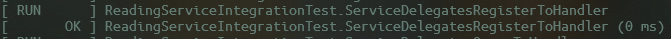
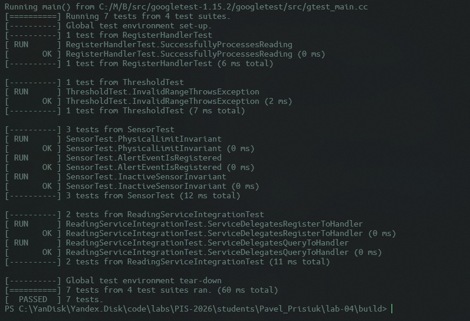

<p align="center">Министерство образования Республики Беларусь</p>
<p align="center">Учреждение образования</p>
<p align="center">"Брестский Государственный технический университет"</p>
<p align="center">Кафедра ИИТ</p>
<br><br><br><br><br><br>
<p align="center"><strong>Лабораторная работа №4</strong></p>
<p align="center"><strong>По дисциплине:</strong> "Проектирование интернет-систем"</p>
<p align="center"><strong>Тема:</strong> "Application Layer: Commands, Queries, Handlers"</p>
<br><br><br><br><br><br>
<p align="right"><strong>Выполнил:</strong></p>
<p align="right">Студент 3 курса</p>
<p align="right">Группа ПО-12</p>
<p align="right">Присюк П.Д.</p>
<p align="right"><strong>Проверил:</strong></p>
<p align="right">Несюк А.Н.</p>
<br><br><br><br><br>
<p align="center"><strong>Брест 2026</strong></p>

---

## Цель работы

Реализовать **прикладной слой** (Application Layer) с разделением операций на **команды** (изменяют состояние) и **запросы** (читают данные) по паттерну CQRS.

---

Вариант №38 - Датчики «Умный дом lite»

Питч: Графики красивее, чем провода.
Ядро домена: Датчики, Показания, Графики, Алерты.

---

## Ход выполнения работы

### 1. Команды (Commands)

**Созданные команды:**

1. **RegisterReadingCommand** -  Регистрация нового показания датчика.
   - Поля: `sensor_id (string), value (double).`
   - Валидация: Проверка существования ID и корректности числового формата.
   - Файл: `application/command/register_reading_command.hpp`

**Пример кода команды:**
```cpp
namespace application::command {
    struct RegisterReadingCommand {
        std::string sensor_id;
        double value;
        RegisterReadingCommand(std::string id, double v) : sensor_id(id), value(v) {}
    };
}
```

---

### 2. Command Handlers

**Созданные обработчики:**

1. **RegisterReadingHandler** - Обрабатывает логику получения данных.
   - Шаги обработки: Загрузка агрегата Sensor из репозитория, вызов доменного метода process_reading, сохранение обновленного состояния агрегата, проверка и публикация доменных событий (алертов).
   - Возвращает: void
   - Файл: `application/command/handlers/register_reading_handler.hpp`

**Пример кода handler:**
```cpp
void handle(const RegisterReadingCommand& cmd) {
    // 1. Поиск датчика (загрузка агрегата)
    auto sensor = repo->find_by_id(cmd.sensor_id);
    if (!sensor) throw std::runtime_error("Sensor not found");

    // 2. Выполнение бизнес-логики домена (инварианты и события)
    sensor->process_reading(cmd.value);

    // 3. Сохранение изменений в инфраструктуру
    repo->save(*sensor);

    // 4. Оркестрация побочных эффектов на основе доменных событий
    for (auto& event : sensor->get_events()) {
        if (std::dynamic_pointer_cast<domain::events::AlertTriggered>(event)) {
            notifier->send_alert(cmd.sensor_id, "CRITICAL VALUE DETECTED!");
        }
    }
    sensor->clear_events();
}
```

**Скриншот теста:**
[ RUN      ] RegisterHandlerTest.SuccessfullyProcessesReading
[       OK ] RegisterHandlerTest.SuccessfullyProcessesReading (0 ms)

---

### 3. Queries (Запросы)

**Созданные запросы:**

   **GetSensorInfo** - Получение текущего статуса датчика.
   - Поля: `id (string).`
   - Файл: `application/port/in/register_reading_use_case.hpp`

**Read DTOs:**

- **SensorDto** - упрощённая модель для чтения
   - Поля: `id, is_active, status_msg`
   - Файл: `application/query/dto/sensor_dto.hpp`

**Пример кода:**
```cpp
namespace application::query::dto {
    struct SensorDto {
        std::string id;
        bool is_active;
        std::string status_msg;
    };
}
```

---

### 4. Query Handlers

**Созданные обработчики запросов:**

   **GetSensorHandler** - Извлекает данные без побочных эффектов.
   - Репозиторий: Использует ReadingRepository для чтения.
   - Возвращает: `SensorDto`
   - Файл: `application/query/handlers/get_sensor_handler.hpp`

**Пример кода:**
```cpp
dto::SensorDto handle(const std::string& id) {
    auto s = repo->find_by_id(id);
    if (!s) throw std::runtime_error("Not found");
    
    // Маппинг Домен -> DTO
    return { s->get_id(), s->get_active(), s->get_active() ? "OK" : "DISABLED" };
}
```

**Скриншот:**



---

### 5. Application Service (Фасад)

**Реализованный сервис:** `ReadingServiceImpl`

**Методы:**

| Метод                   | Тип     | Возвращает |
| ----------------------- | ------- | ---------- |
| `register_reading(cmd)` | Command | "SUCCESS"  |
| `get_sensor_info(id)`   | Query   | SensorDto  |

**Пример кода:**
```cpp
std::string ReadingServiceImpl::register_reading(const port::in::RegisterReadingCommand& cmd) {
    // Делегирование ответственности специализированному хендлеру
    reg_h->handle({cmd.sensor_id, cmd.value});
    return "SUCCESS";
}
```

---

### 6. Тестирование

**Юнит-тесты:**

| Тест                                               | Что проверяет                                     | Статус |
| -------------------------------------------------- | ------------------------------------------------- | ------ |
| `RegisterHandlerTest.SuccessfullyProcessesReading` | Вызов хендлера команды и сохранение в репозиторий | ✅      |
| `ServiceDelegatesRegisterToHandler`                | Корректную работу фасада как оркестратора         | ✅      |
| `ServiceDelegatesQueryToHandler`                   | Корректность маппинга данных в DTO при запросе    | ✅      |

**Скриншот GTest:**



---

## Таблица критериев оценки

| Критерий                                              | Баллы   | Выполнено |
| ----------------------------------------------------- | ------- | --------- |
| Команды (DTOs): иммутабельность, валидация примитивов | 15      | ✅         |
| Command Handlers: транзакции, события, сохранение     | 25      | ✅         |
| Запросы (DTOs): read-модели без побочных эффектов     | 10      | ✅         |
| Query Handlers: преобразование домена в DTO           | 15      | ✅         |
| Application Service (фасад): делегирование            | 20      | ✅         |
| Юнит-тесты handlers: mocker, события                  | 10      | ✅         |
| Качество документации                                 | 5       | ✅         |
| **ИТОГО**                                             | **100** |           |

---

## Бонусы

| Бонус                                      | Баллы | Выполнено |
| ------------------------------------------ | ----- | --------- |
| REST API контроллер (HTTP endpoints)       | +5    | ✅         |
| Bean Validation (@NotBlank, @Valid)        | +4    | ❌ / ✅     |
| Exception Handling (глобальный обработчик) | +3    | ✅         |
| OpenAPI документация (Swagger)             | +3    | ❌ / ✅     |

**ИТОГО бонусов:** 8 / 15

---

## Контрольные вопросы

1. **В чём разница между Command и Query?**
   - Command (Команда) выражает намерение изменить состояние системы и не должна возвращать бизнес-данные. Query (Запрос) только считывает данные, не вызывая побочных эффектов.

2. **Почему Command Handler возвращает только ID, а не весь объект?**
   - Чтобы соблюсти принцип разделения ответственности и избежать передачи тяжелых доменных объектов наружу. Клиент должен сам запросить данные через Query, если они ему нужны.

3. **Где должна выполняться валидация: в команде, обработчике или доменной модели?**
   - Валидация типов и форматов — в Команде. Проверка существования сущностей — в Обработчике. Бизнес-инварианты — в Доменной модели.

4. **Можно ли вызывать Query из Command Handler?**
   - Не рекомендуется, так как это связывает два разных потока ответственности и может привести к циклическим зависимостям.

5. **Зачем разделять Request DTO (от клиента) и Command (внутренний)?**
   - Request DTO зависит от формата передачи (JSON/Crow), а Command — это чистая структура приложения. Это позволяет менять API (например, перейти на gRPC), не затрагивая логику приложения.

---

## Ссылка на репозиторий

👉 **GitHub:** https://github.com/DakariLuin/PIS-2026

**Структура папки:**
```
src/application/
├── command/
│   ├── register_reading_command.hpp
│   └── handlers/
│       └── register_reading_handler.hpp
├── query/
│   ├── get_sensor_query.hpp
│   ├── dto/
│   │   └── sensor_dto.hpp
│   └── handlers/
│       └── get_sensor_handler.hpp
└── service/
    ├── reading_service_impl.hpp
    └── reading_service_impl.cpp
```

---

## Вывод

В ходе работы был реализован полноценный прикладной слой с использованием паттернов CQRS и Facade. Логика системы была декомпозирована на мелкие, легко тестируемые обработчики. Применение Command/Query Handlers позволило изолировать бизнес-операции от интерфейса пользователя и обеспечить высокую расширяемость системы.

---

**Дата выполнения:** 13.04.2026  
**Оценка:** _____________  
**Подпись преподавателя:** _____________
