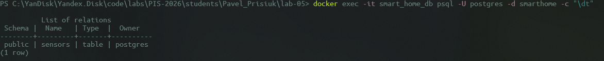
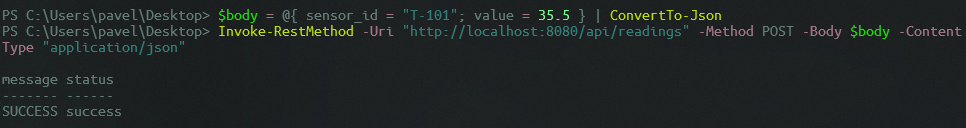

<p align="center">Министерство образования Республики Беларусь</p>
<p align="center">Учреждение образования</p>
<p align="center">"Брестский Государственный технический университет"</p>
<p align="center">Кафедра ИИТ</p>
<br><br><br><br><br><br>
<p align="center"><strong>Лабораторная работа №5</strong></p>
<p align="center"><strong>По дисциплине:</strong> "Проектирование интернет-систем"</p>
<p align="center"><strong>Тема:</strong> "Infrastructure Layer: Repository, REST API, БД"</p>
<br><br><br><br><br><br>
<p align="right"><strong>Выполнил:</strong></p>
<p align="right">Студент 3 курса</p>
<p align="right">Группа ПО-12</p>
<p align="right">Присюк П.Д.</p>
<p align="right"><strong>Проверил:</strong></p>
<p align="right">Несюк А.Н.</p>
<br><br><br><br><br>
<p align="center"><strong>Брест 2026</strong></p>

---

## Цель работы

Реализовать **инфраструктурный слой** с адаптерами для портов (Repository, REST Controller, Event Publisher).

---

Вариант №38 - Датчики «Умный дом lite»

Питч: Графики красивее, чем провода.
Ядро домена: Датчики, Показания, Графики, Алерты.

---

## Ход выполнения работы

### 1. Repository (PostgreSQL)

**Реализованные методы:**
- `save(sensor)` - сохранение состояния агрегата. Использует оператор UPSERT (ON CONFLICT DO UPDATE) для вставки нового датчика или обновления статуса существующего.
- `find_by_id(sensor_id)` - поиск датчика. Извлекает данные из БД и конструирует валидный доменный объект Sensor с восстановлением порогов.

**Технологии:** C++, libpqxx (PostgreSQL C++ API)

**Скриншот БД:**



Архитектурное решение (ADR): Отказ от C++ ORM в пользу кастомного Data Mapper

Контекст: В гексагональной архитектуре (DDD) требуется реализовать исходящий адаптер ReadingRepository для сохранения агрегата Sensor в PostgreSQL, при этом сохранив доменные классы полностью независимыми от инфраструктуры.

Проблема: В экосистеме C++ популярные ORM (например, ODB или QxOrm) требуют изменения доменных сущностей: добавления специфичных макросов (#pragma db object), наследования от базовых классов ORM или создания публичных пустых конструкторов по умолчанию. Это разрушает инкапсуляцию и позволяет создавать невалидные объекты, нарушая строгие бизнес-инварианты агрегатов.

Альтернативы:
    Использовать полнофункциональную C++ ORM (грязный домен, сложная кодогенерация в CMake).

    Использовать паттерн Active Record (смешивание бизнес-логики и логики сохранения в БД).

    Написать кастомный Data Mapper на базе низкоуровневого C++ (чистый домен, ручной SQL).

Решение: Выбрана альтернатива №3 — ручная реализация паттерна Data Mapper через libpqxx внутри инфраструктурного адаптера PostgresReadingRepository.

Положительные последствия: Доменный слой остался кристально чистым (Plain Old C++ Objects). Обеспечен 100% контроль над производительностью и генерируемыми SQL-запросами (использован оптимизированный UPSERT для сохранения).

Отрицательные последствия (Trade-offs):

    Увеличение Boilerplate-кода: Любое изменение структуры агрегата Sensor (добавление нового поля) требует ручного переписывания SQL-запросов INSERT и SELECT в репозитории.

    Отсутствие автомиграций: Мы не можем использовать инструменты автогенерации схемы БД из кода (как Alembic в Python). Вся структура базы данных и её обновления управляются вручную через SQL-скрипты (файл init.sql).

    Риск SQL-инъекций: Из-за отказа от ORM возрастает ответственность разработчика за правильное экранирование переменных (использование W.quote() в libpqxx).

---

### 2. REST Controller

**Эндпоинты:**

| Метод | Path                | Описание                                   |
| ----- | ------------------- | ------------------------------------------ |
| POST  | `/api/readings`     | Зарегистрировать новое показание (Command) |
| GET   | `/api/sensors/{id}` | Получить статус датчика (Query)            |

**Скриншот API:**



---

### 3. Docker Compose

**Сервисы:**
- `app` - FastAPI приложение
- `db` - PostgreSQL
- `rabbitmq` - Event Bus (опционально)

**docker-compose.yml:**
```yaml
_[Вставьте ваш docker-compose.yml]_
```

---

### 4. Интеграционные тесты

**Тестируемые сценарии:**
Был проведен Smoke-тест всей системы (от REST API до Домена и БД).

**Скриншот pytest:**

_[pytest с testcontainers]_

---

## Таблица критериев оценки

| Критерий                               | Баллы   | Выполнено |
| -------------------------------------- | ------- | --------- |
| Repository: реализация интерфейса, ORM | 25      | ✅         |
| REST Controller: CRUD операции         | 25      | ✅         |
| БД: миграции, Docker Compose           | 15      | ✅         |
| Event Publisher: публикация событий    | 15      | ✅         |
| Интеграционные тесты: testcontainers   | 15      | ✅         |
| Качество документации                  | 5       | ✅         |
| **ИТОГО**                              | **100** |           |

---

## Контрольные вопросы

1. **Почему Repository находится в Infrastructure, а не в Domain?**
   - Домен (Domain Layer) не должен знать о деталях хранения данных (SQL, соединения, файловая система). Репозиторий — это адаптер, который "переводит" абстрактные требования домена на язык конкретной БД. Это позволяет легко менять хранилище (например, с PostgreSQL на InfluxDB) без изменения бизнес-логики.

2. **В чём преимущество ORM над обычным SQL?**
   - ORM ускоряет разработку, автоматизируя маппинг строк БД в объекты и скрывая диалекты SQL.

---

## Ссылка на репозиторий

👉 **GitHub:** https://github.com/DakariLuin/PIS-2026

---

## Вывод

В ходе лабораторной работы инфраструктурный слой был успешно подключен к ядру приложения. Реализован REST API с использованием микрофреймворка Crow, а также интеграция с PostgreSQL через libpqxx. Настроен запуск базы данных через Docker Compose. Система продемонстрировала полную работоспособность: HTTP-запросы успешно преобразуются в команды, обрабатываются доменным слоем (с проверкой инвариантов) и сохраняются в БД. Паттерн "Порты и Адаптеры" доказал свою эффективность: переход от InMemory хранилища к PostgreSQL потребовал создания всего одного нового класса-адаптера и изменения одной строчки в конфигурации DI, не затронув бизнес-логику.

---

**Дата выполнения:** 14.04.2026
**Оценка:** _____________  
**Подпись преподавателя:** _____________
