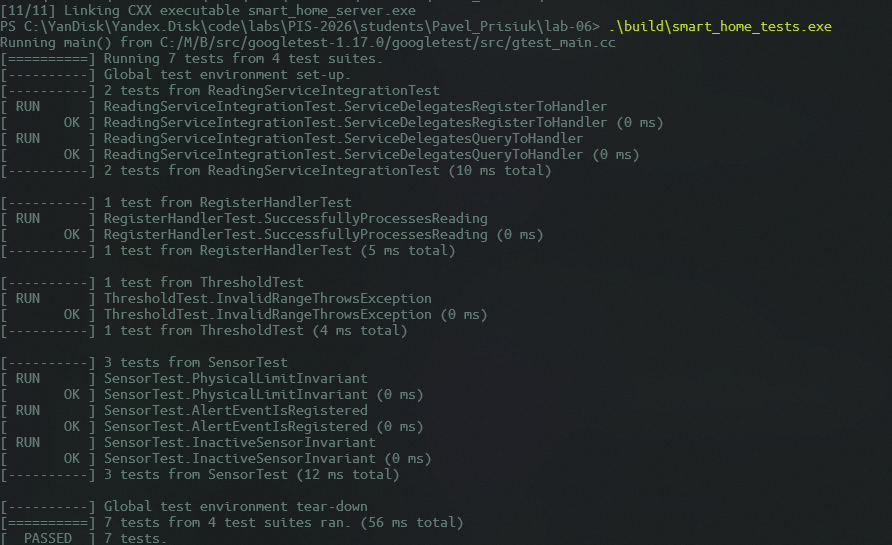
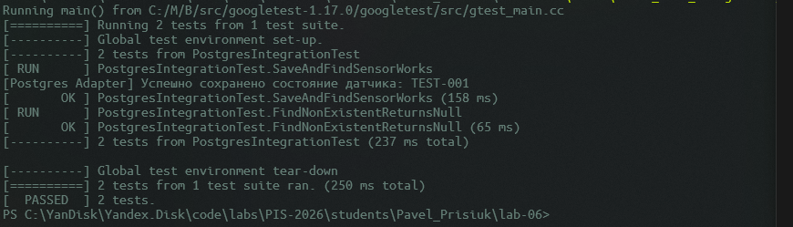
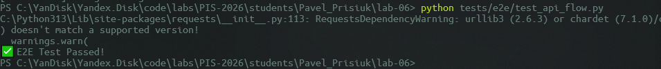

Министерство образования Республики Беларусь

Учреждение образования

"Брестский Государственный технический университет"

Кафедра ИИТ

      

<strong>Лабораторная работа №6</strong>

<strong>По дисциплине:</strong> "Проектирование интернет-систем"

<strong>Тема:</strong> "Стратегия тестирования: Unit, Integration, E2E"

      

<strong>Выполнил:</strong>

Студент 3 курса

Группа ПО-12

Присюк П.Д.

<strong>Проверил:</strong>

Несюк А.Н.

     

<strong>Брест 2026</strong>

---

## Цель работы

Создать комплексную стратегию тестирования (юнит, integration, E2E).

---

Вариант №38 - Датчики «Умный дом lite»

Питч: Графики красивее, чем провода.
Ядро домена: Датчики, Показания, Графики, Алерты.

---

## Ход выполнения работы

### 1. Юнит-тесты (Domain)

**Покрытие:** 100% инвариантов агрегата.
**Примеры:**
- SensorTest.PhysicalLimitInvariant: проверка физических границ данных.
- SensorTest.AlertEventIsRegistered: проверка генерации доменных событий.

**Скриншот Gtest**

---

### 2. Интеграционные тесты (БД)

**Testcontainers PostgreSQL:**

**Примеры:**
- SaveAndFindSensorWorks (проверка сохранения агрегата в SQL).
- FindNonExistentReturnsNull (проверка обработки отсутствующих записей).

**Скриншот:**

---

### 3. E2E-тесты

**Сценарий:**
1. GET /api/sensors/T-101 → проверить начальное состояние (существование датчика).
2. POST /api/readings → отправить критическое показание.
3. GET /api/sensors/T-101 → проверить, что данные прошли через всю систему (контроллер-хендлер-домен-БД).

**Скриншот:**

---

## Таблица критериев оценки

| Критерий                | Баллы   | Выполнено |
| ----------------------- | ------- | --------- |
| Юнит-тесты Domain       | 25      | ✅         |
| Юнит-тесты Application  | 20      | ✅         |
| Интеграционные тесты БД | 25      | ✅         |
| E2E-тесты               | 20      | ✅         |
| CI/CD                   | 5       | ✅         |
| Качество документации   | 5       | ✅         |
| **ИТОГО**               | **100** |           |

---

## Вывод

✍️ _[Краткий вывод]_

---

**Дата выполнения:** _[Дата]_  
**Оценка:** _____________  
**Подпись преподавателя:** _____________
