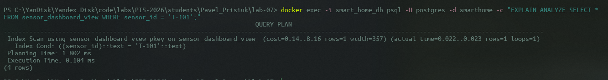

<p align="center">Министерство образования Республики Беларусь</p>
<p align="center">Учреждение образования</p>
<p align="center">"Брестский Государственный технический университет"</p>
<p align="center">Кафедра ИИТ</p>
<br><br><br><br><br><br>
<p align="center"><strong>Лабораторная работа №7</strong></p>
<p align="center"><strong>По дисциплине:</strong> "Проектирование интернет-систем"</p>
<p align="center"><strong>Тема:</strong> "CQRS и Read Models"</p>
<br><br><br><br><br><br>
<p align="right"><strong>Выполнил:</strong></p>
<p align="right">Студент 3 курса</p>
<p align="right">Группа ______</p>
<p align="right">_[ваше ФИО]_</p>
<p align="right"><strong>Проверил:</strong></p>
<p align="right">Несюк А.Н.</p>
<br><br><br><br><br>
<p align="center"><strong>Брест 2026</strong></p>

---

## Цель работы

Реализовать CQRS с разделением Write Model и Read Model.

---

Вариант №38 - Датчики «Умный дом lite»

Питч: Графики красивее, чем провода.
Ядро домена: Датчики, Показания, Графики, Алерты.

---

## Ход выполнения работы

### 1. Write Model

**Агрегат:** Sensor

**Структура:**
- Нормализованные таблицы: Таблица sensors содержит только необходимые данные для работы бизнес-логики: ID, имя, флаг активности и настройки порогов срабатывания.
- Инварианты: Вся логика валидации (проверка Min/Max порогов, физических лимитов и состояния датчика) сосредоточена в C++ классах доменного слоя. База данных используется только для персистентного хранения текущего состояния агрегата.

---

### 2. Read Model

**Проекция:** sensor_dashboard_view

**Структура:**
- Денормализованная таблица.  Специальная таблица sensor_dashboard_view, оптимизированная для мгновенного отображения дашборда. Она содержит предвычисленные данные (счетчик алертов) и денормализованные поля (имя датчика), что исключает необходимость выполнения дорогостоящих операций JOIN или COUNT при каждом запросе.
- JOIN предзаг руженные. Доступ к данным осуществляется по первичному ключу sensor_id с использованием индекса.

Для подтверждения эффективности Read Model был выполнен запрос EXPLAIN ANALYZE. Результат показывает использование Index Scan вместо последовательного сканирования, что гарантирует константное время ответа при росте объема данных телеметрии.

**Скриншот БД:**



---

### 3. Event-Driven Sync

**События:**
- `ReadingProcessed` → Обновление полей last_value и last_update в проекции sensor_dashboard_view.
- `AlertTriggered` → Атомарный инкремент поля total_alerts_count в Read Model.

**Код:**
```cpp
void on_alert_triggered(const std::string& id) {
    pqxx::connection C(conn_str);
    pqxx::work W(C);
    // Инкремент предвычисленного поля в Read Model
    W.exec("UPDATE sensor_dashboard_view SET total_alerts_count = total_alerts_count + 1 "
           "WHERE sensor_id = " + W.quote(id));
    W.commit();
}
```

---

## Таблица критериев оценки

| Критерий              | Баллы   | Выполнено |
| --------------------- | ------- | --------- |
| Write Model           | 20      | ✅         |
| Read Model            | 25      | ✅         |
| Event-Driven Sync     | 25      | ✅         |
| Оптимизация запросов  | 15      | ✅         |
| Тесты проекций        | 10      | ✅         |
| Качество документации | 5       | ✅         |
| **ИТОГО**             | **100** |           |

---

## Вывод

В ходе выполнения лабораторной работы был реализован паттерн CQRS. Разделение ответственности позволило создать строгую и надежную Write Model для обработки команд с проверкой всех инвариантов и высокопроизводительную Read Model для мгновенного отображения состояния умного дома. Механизм синхронизации на основе событий обеспечил автоматическое обновление дашборда. Проект на C++ продемонстрировал преимущества разделения моделей при работе с высоконагруженными потоками данных.

---

**Дата выполнения:** 16.04.2026
**Оценка:** _____________  
**Подпись преподавателя:** _____________
