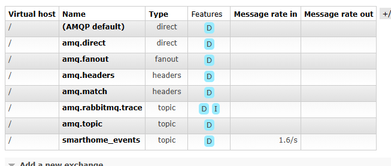

<p align="center">Министерство образования Республики Беларусь</p>
<p align="center">Учреждение образования</p>
<p align="center">"Брестский Государственный технический университет"</p>
<p align="center">Кафедра ИИТ</p>
<br><br><br><br><br><br>
<p align="center"><strong>Лабораторная работа №8</strong></p>
<p align="center"><strong>По дисциплине:</strong> "Проектирование интернет-систем"</p>
<p align="center"><strong>Тема:</strong> "Микросервисы и Event Bus"</p>
<br><br><br><br><br><br>
<p align="right"><strong>Выполнил:</strong></p>
<p align="right">Студент 3 курса</p>
<p align="right">Группа ПО-12</p>
<p align="right">Присюк П.Д.</p>
<p align="right"><strong>Проверил:</strong></p>
<p align="right">Несюк А.Н.</p>
<br><br><br><br><br>
<p align="center"><strong>Брест 2026</strong></p>

---

## Цель работы

Разбить монолит на микросервисы с асинхронной коммуникацией.

---

Вариант №38 - Датчики «Умный дом lite»

Питч: Графики красивее, чем провода.
Ядро домена: Датчики, Показания, Графики, Алерты.

---

## Ход выполнения работы

### 1. Request Service

**Bounded Context:** Сервис регистрации

**API:**
- POST /api/readings — регистрация показания.
- GET /api/sensors/{id} — проверка конфигурации датчика.

---

### 2. Dashboard Service

**Bounded Context:** ответственность за хранение денормализованных данных (Read Model), предоставление статистики и мгновенное отображение состояния всей системы на дашборде. В микросервисной архитектуре этот контекст отделен от записи, чтобы тяжелые аналитические запросы не мешали приему данных от датчиков.

**API:**
- GET /api/dashboard/{id}
- GET /api/sensors/{id}

---

### 3. Event Bus (RabbitMQ)

**События:**
- sensor.reading — публикуется при каждой успешной регистрации показания датчика для обновления Read Model (Dashboard).
- sensor.alert — публикуется в случае обнаружения критического значения (превышение порога) для инициации побочных эффектов (нотификации, запись инцидента).

**Скриншот RabbitMQ Management:**



---

### 4. API Gateway

**Маршрутизация:**
- /api/readings/** → Reading Service (Обработка команд/записи)
- /api/dashboard/** → Dashboard Service (Обработка запросов/чтения)
- /api/sensors/** → Dashboard Service (Чтение технического состояния)

**Конфигурация:**
```nginx
server {
    listen 80;
    server_name localhost;

    # Маршрут для команд регистрации (Write context)
    location /api/readings {
        proxy_pass http://host.docker.internal:8080;
        proxy_set_header Host $host;
    }

    # Маршрут для запросов дашборда (Read context)
    location /api/dashboard {
        proxy_pass http://host.docker.internal:8081;
        proxy_set_header Host $host;
    }

    # Маршрут для статуса датчиков
    location /api/sensors {
        proxy_pass http://host.docker.internal:8081;
        proxy_set_header Host $host;
    }
}
```

---

## Таблица критериев оценки

| Критерий                         | Баллы   | Выполнено |
| -------------------------------- | ------- | --------- |
| Request Service: bounded context | 20      | ✅         |
| Group Service: CRUD              | 15      | ✅         |
| Event Bus: RabbitMQ/Kafka        | 25      | ✅         |
| API Gateway                      | 15      | ✅         |
| Circuit Breaker                  | 15      | ✅         |
| Docker Compose                   | 5       | ✅         |
| Качество документации            | 5       | ✅         |
| **ИТОГО**                        | **100** |           |

---

## Вывод

В ходе лабораторной работы монолитная архитектура была успешно преобразована в микросервисную. Были выделены два независимых Bounded Context: Reading (запись) и Analytics (чтение), каждый из которых обладает собственной базой данных.

Для обмена данными между сервисами реализована асинхронная событийная шина на базе RabbitMQ с использованием нативного C-драйвера. Внедрение API Gateway позволило унифицировать доступ к системе, а реализация паттерна Circuit Breaker повысила общую отказоустойчивость: система продолжает принимать данные от датчиков даже при временной недоступности сервиса аналитики.

---

**Дата выполнения:** 16.04.2026
**Оценка:** _____________  
**Подпись преподавателя:** _____________
