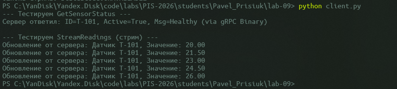
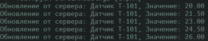

<p align="center">Министерство образования Республики Беларусь</p>
<p align="center">Учреждение образования</p>
<p align="center">"Брестский Государственный технический университет"</p>
<p align="center">Кафедра ИИТ</p>
<br><br><br><br><br><br>
<p align="center"><strong>Лабораторная работа №9</strong></p>
<p align="center"><strong>По дисциплине:</strong> "Проектирование интернет-систем"</p>
<p align="center"><strong>Тема:</strong> "Protocol Buffers и gRPC"</p>
<br><br><br><br><br><br>
<p align="right"><strong>Выполнил:</strong></p>
<p align="right">Студент 3 курса</p>
<p align="right">Группа ПО-12</p>
<p align="right">Присюк П.Д.</p>
<p align="right"><strong>Проверил:</strong></p>
<p align="right">Несюк А.Н.</p>
<br><br><br><br><br>
<p align="center"><strong>Брест 2026</strong></p>

---

## Цель работы

Заменить REST API на gRPC для межсервисной коммуникации.

---

Вариант №38 - Датчики «Умный дом lite»

Питч: Графики красивее, чем провода.
Ядро домена: Датчики, Показания, Графики, Алерты.

---

## Ход выполнения работы

### 1. Протофайлы (.proto)

**request_service.proto:**
```protobuf
syntax = "proto3";

package smarthome;

// Текущее состояние датчика
message SensorStatusRequest {
  string sensor_id = 1;
}

message SensorStatusResponse {
  string id = 1;
  bool is_active = 2;
  string status_msg = 3;
}

// Поток данных (Streaming)
message StreamRequest {
  string sensor_id = 1;
}

message ReadingUpdate {
  string sensor_id = 1;
  double value = 2;
}

service SmartHomeService {
  // Unary RPC (Замена REST GET)
  rpc GetSensorStatus(SensorStatusRequest) returns (SensorStatusResponse);

  // Server-side Streaming (Real-time поток данных)
  rpc StreamReadings(StreamRequest) returns (stream ReadingUpdate);
}
```

---

### 2. gRPC Server

**Реализованные методы:**
- GetSensorStatus: возвращает статус датчика.
- StreamReadings: имитирует отправку показаний датчика в реальном времени.

**Код:**
```cpp
class SmartHomeGrpcService final : public SmartHomeService::Service {
  // Unary RPC
  Status GetSensorStatus(ServerContext* context, const smarthome::SensorStatusRequest* request,
    smarthome::SensorStatusResponse* response) override {
    response->set_id(request->sensor_id());
    response->set_is_active(true);
    response->set_status_msg("Healthy (via gRPC Binary)");
    return Status::OK;
  }

  // Server-side Streaming
  Status StreamReadings(ServerContext* context, const smarthome::StreamRequest* request,
    grpc::ServerWriter<smarthome::ReadingUpdate>* writer) override {
    for (int i = 0; i < 5; ++i) {
      smarthome::ReadingUpdate update;
      update.set_sensor_id(request->sensor_id());
      update.set_value(20.0 + i * 1.5);
      writer->Write(update); // Отправка в поток
      std::this_thread::sleep_for(std::chrono::seconds(1));
    }
    return Status::OK;
  }
};
```

---

### 3. gRPC Client

**Тест вызова:**
```python
import grpc
import smarthome_pb2
import smarthome_pb2_grpc

def run():
    # 1. Подключаемся к твоему C++ серверу
    with grpc.insecure_channel('localhost:50051') as channel:
        stub = smarthome_pb2_grpc.SmartHomeServiceStub(channel)

        # 2. Тестируем Unary RPC (запрос-ответ)
        print("--- Тестируем GetSensorStatus ---")
        request = smarthome_pb2.SensorStatusRequest(sensor_id="T-101")
        try:
            response = stub.GetSensorStatus(request)
            print(f"Сервер ответил: ID={response.id}, Active={response.is_active}, Msg={response.status_msg}")
        except grpc.RpcError as e:
            print(f"Ошибка: {e.code()} - {e.details()}")

        # 3. Тестируем Server Streaming (поток данных)
        print("\n--- Тестируем StreamReadings (стрим) ---")
        stream_request = smarthome_pb2.StreamRequest(sensor_id="T-101")
        try:
            for update in stub.StreamReadings(stream_request):
                print(f"Обновление от сервера: Датчик {update.sensor_id}, Значение: {update.value:.2f}")
        except grpc.RpcError as e:
            print(f"Ошибка стрима: {e.code()}")

if __name__ == '__main__':
    run()
```

**Скриншот:**



---

### 4. Server-Side Streaming

**Сценарий:**
Клиент запрашивает поток данных для датчика T-101. Сервер отправляет 5 обновлений с задержкой в 1 секунду.

**Скриншот:**



---

## Таблица критериев оценки

| Критерий                | Баллы   | Выполнено |
| ----------------------- | ------- | --------- |
| Протофайлы (.proto)     | 20      | ✅         |
| gRPC Server             | 25      | ✅         |
| gRPC Client             | 20      | ✅         |
| Streaming               | 20      | ✅         |
| Генерация кода (protoc) | 10      | ✅         |
| Качество документации   | 5       | ✅         |
| **ИТОГО**               | **100** |           |

---

## Контрольные вопросы

1. **В чём преимущество gRPC над REST?**
   - gRPC использует бинарный формат Protobuf и протокол HTTP/2. Это делает сообщения намного компактнее, чем JSON, и позволяет мультиплексировать запросы в одном соединении. Также gRPC обеспечивает строгую типизацию "из коробки".

2. **Почему Protocol Buffers быстрее JSON?**
   - Protobuf — это бинарный формат. В нем не передаются имена полей в каждом сообщении (используются числовые теги), а сериализация и десериализация требуют значительно меньше ресурсов процессора, чем парсинг текстового JSON.

3. **Зачем нужен streaming в gRPC?**
   - Streaming позволяет передавать большие объемы данных по частям или поддерживать долгоживущее соединение для передачи обновлений в реальном времени без необходимости постоянно открывать новые HTTP-запросы (long polling).

---

## Ссылка на репозиторий

👉 **GitHub:** https://github.com/DakariLuin/PIS-2026

---

## Вывод

В ходе работы был успешно настроен gRPC сервер на C++, работающий в связке с MSYS2 и vcpkg. Была реализована поддержка бинарных контрактов и потоковой передачи данных. gRPC показал себя как эффективный инструмент для создания быстрых внутренних интерфейсов систем.

---

**Дата выполнения:** 16.04.2026
**Оценка:** _____________  
**Подпись преподавателя:** _____________
